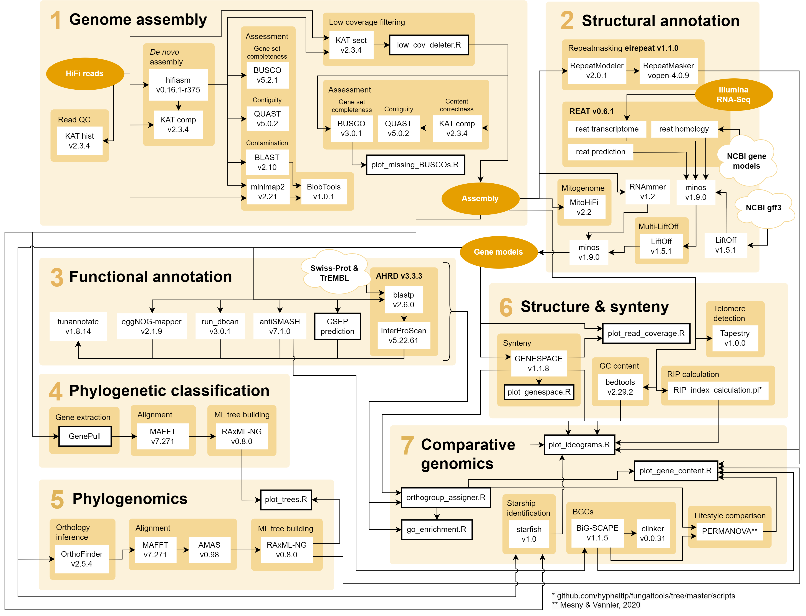

# Gaeumannomyces Genomics

Bioinformatics workflow for:
> Hill et al. (in prep) ***

The pipeline was written for and run on Norwich BioScience Institutes' HPC cluster which uses the SLURM batch-queue system. This means that many of the bash scripts (`.sh` file endings) specify core allocation, run times and memory usage allocation that may need to be adapted for different platforms.

Associated data files: 

---

## 1 *De novo* genome assembly

`cd 01_assembly` 📁

### Checking reads

1. `sbatch -a 1-9 001_kat_hist.sh` produces kmer histograms for the raw HiFi reads using [KAT](https://github.com/TGAC/KAT).

### Assembly

2. `sbatch -a 1-9 002_hifiasm.sh` assembles HiFi reads using [hifiasm](https://github.com/chhylp123/hifiasm).
3. `sbatch -a 1-9 003_kat_comp.sh` checks for content correctness of assemblies with respect to the input HiFi reads using KAT.

### Assessment

4. `sbatch 004_quast.sh` produces assembly contiguity statistics using [QUAST](https://github.com/ablab/quast).
5. `sbatch -a 1-9 005_busco_asco.sh` produces gene set completeness statistics using [BUSCO](https://busco.ezlab.org/).
6. `sbatch -a 1-9 006_blastn.sh` searches the assembly against the NCBI nucleotide database using [BLAST](https://blast.ncbi.nlm.nih.gov/Blast.cgi) to produce input for BlobTools.
7. `sbatch -a 1-9 007_readsmap.sh` maps HiFi reads to the assembly using [minimap2](https://github.com/lh3/minimap2) to produce input for BlobTools.
8. `sbatch -a 1-9 008_blobtools.sh` runs a contamination check using [BlobTools](https://github.com/DRL/blobtools).

### Filtering

9. `sbatch -a 1-9 009_kat_sect.sh` estimates assembly coverage levels using KAT.
10. `sbatch -a 1-9 010_filter_lowcov.sh` filters out small, low coverage sequences using a custom script, `low_cov_deleter.R`.

### Final assessment

11. `sbatch -a 1-9 011_kat_comp.sh` reruns KAT comp to check final content correctness of the filtered assemblies.
12. `sbatch -a 1-9 012_busco_asco.sh` reruns BUSCO on the filtered assemblies.
13. `sbatch 013_quast.sh` reruns QUAST on the filtered assemblies.
14. `sbatch -a 1-9 014_tapestry.sh` predicts telomeric repeats on the ends of fragments using [Tapestry](https://github.com/johnomics/tapestry).\
    `sbatch -a 1-9 014_tidk.sh` predicts telomeric repeats across fragments using [tidk](https://github.com/tolkit/telomeric-identifier).
16. Script to plot figures: `plot_missing_BUSCOs.R`

## 2 Structural annotation

`cd 02_structural_annotation` 📁

1. `000_liftoff.txt` contains the commands to generate the liftover gene model using the previous annotation of *G. tritici* using [LiftOff](https://github.com/agshumate/Liftoff).
2. `001_eirepeat.txt` contains the commands used to predict and mask repeat content using the [eirepeat](https://github.com/EI-CoreBioinformatics/eirepeat) pipeline, which is comprised of [RepeatModeler](https://www.repeatmasker.org/RepeatModeler), [RepeatMasker](http://www.repeatmasker.org/RepeatMasker) and [Red](http://toolsmith.ens.utulsa.edu/).
3. `002_reat_transcriptome.txt` contains the commands used to predict gene models using [REAT](https://github.com/EI-CoreBioinformatics/reat) transcriptome module. This makes [Mikado](https://github.com/EI-CoreBioinformatics/Mikado) to consolidate gene models.
4. `003_reat_homology.txt` contains the commands used to predict gene models using [REAT](https://github.com/EI-CoreBioinformatics/reat) homology module. This module uses Splan to generate protein to genome alignments and leverages [Mikado](https://github.com/EI-CoreBioinformatics/Mikado) to score them and generate a final conscensus of the best gene models.
5. `004_reat_prediction.txt` contains the commands used to predict gene models using [REAT](https://github.com/EI-CoreBioinformatics/reat) transcriptome module. It uses evidence provided by the final output of the previous two modules, Portcullis and [eirepeat](https://github.com/EI-CoreBioinformatics/eirepeat) to train Augustus to generate four different annotations using differential weighting of the evidences. It also generate a conscensus track using EVM and runs Mikado to recover UTR information.
6. `005_minos.txt` contains the commands used to perform a first consolidation of the all the gene models produced before using [MINOS](https://github.com/EI-CoreBioinformatics/minos). This tool runs blastp, kallisto and CPC2 to generate score metrics to use as an input in [Mikado](https://github.com/EI-CoreBioinformatics/Mikado) to make sensible and standarized decision of the best gene models given a series of high quality annota
7. `006_rnammer.txt` contains the commands used to predict ribosomal RNA sub units using [RNAmmer](https://services.healthtech.dtu.dk/services/RNAmmer-1.2/).
8. `007_liftover_multi.txt` contains the commands used to perform an all-versus-all comparison of gene models across all strains using [LiftOff](https://github.com/agshumate/Liftoff).
9. `008_filter_rRNA.txt` contains the commands used to filter the input annotations to the final [MINOS](https://github.com/EI-CoreBioinformatics/minos) step to avoid scoring rRNA as possible protein coding genes.
10. `009_rerun_minos.txt` contains the commands used to perform a final minos including the liftover annotation of the all vs. all comparsion of all the previous strain annotations generated in the step 5.

## 3 Functional annotation

`cd 03_functional_annotation` 📁

1. `001_ahrd.txt` contains the commands used to perform functional annotation of protein sets using [AHRD](https://github.com/groupschoof/AHRD), via the snakemake pipeline [eifunannot](https://github.com/EI-CoreBioinformatics/eifunannot).
2. `sbatch -a 1-9 002_run_dbcan.sh` predicts CAZymes from protein sets using [run_dbcan](https://github.com/linnabrown/run_dbcan).
3. `sbatch -a 1-9 003_antismash.sh` predicts secondary metabolites from protein sets using [antiSMASH](https://github.com/antismash/antismash).
4. `004_eggnog-mapper.txt` contains the commands used to perform functional annotation of protein sets using [eggNOG-mapper](https://github.com/eggnogdb/eggnog-mapper).

### CSEP prediction

5. `sbatch -a 1-9 005_CSEP_prediction.sh` submits a suite of tools that feed into CSEP prediction: `deepsig.sh` ([DeepSig](https://github.com/BolognaBiocomp/deepsig)), `deeploc.sh` ([DeepLoc](https://services.healthtech.dtu.dk/services/DeepLoc-1.0/)), `effectorp1.sh` ([EffectorP v1](https://github.com/JanaSperschneider/EffectorP-1.0)), `effectorp2.sh` ([EffectorP v2](https://github.com/JanaSperschneider/EffectorP-2.0)), `effectorp3.sh` ([EffectorP v3](https://github.com/JanaSperschneider/EffectorP-3.0)), `phobius.sh` ([Phobius](https://phobius.sbc.su.se/)), [`ps_scan.sh`](https://github.com/ebi-pf-team/interproscan/blob/master/core/jms-implementation/support-mini-x86-32/bin/prosite/ps_scan.pl), `signalp3.sh` ([SignalP v3](https://services.healthtech.dtu.dk/services/SignalP-3.0/)), `signalp4.sh` ([SignalP v4.1](https://services.healthtech.dtu.dk/services/SignalP-4.1/)), `signalp6.sh` ([SignalP v6](https://services.healthtech.dtu.dk/services/SignalP-6.0/)), `targetp.sh` ([TargetP](https://services.healthtech.dtu.dk/services/TargetP-2.0/)), `tmhmm.sh` ([TMHMM](https://services.healthtech.dtu.dk/services/TMHMM-2.0/)).
6. `sbatch 006_CSEPfilter.sh` runs `CSEPfilter` to produce a list of CSEPs from the outputs of tools listed above.
7. `sbatch -a 1-9 007_blast.sh` searches CSEP sequences against the [PHI-base database](http://www.phi-base.org/) (requires `phi-base_current.fas` and `phi-base_current.csv` to be downloaded into this directory from [here](http://www.phi-base.org/downloadLink.htm)). Also searches for avenacinase gene and MAT loci in assemblies.

## 4 Phylogenetic classification

`cd 04_phylogenetic_classification` 📁

This folder contains a file - `markers` - listing the genetic markers selected for building the trees.

### Gene extraction

1. `sbatch 001_genepull.sh` uses [GenePull](https://github.com/Rowena-h/MiscGenomicsTools/tree/main/GenePull) to extract selected genetic markers from filtered assemblies of each strain. Requires fasta files containing a single example sequence from a closely related taxon for each genetic marker being extracted.

### Alignment and ML tree building

2. `sbatch 002_align_multicopy.sh` makes gene alignments using [MAFFT](https://github.com/GSLBiotech/mafft) for gdo and ITS2 for distinguishing *Gaeumannomyces* genetic groups and the avenacinase gene.
3. `sbatch 003_raxmlng_genetree.sh` builds ML gene trees for each marker using [RAxML-NG](https://github.com/amkozlov/raxml-ng) with bootstrapping until convergence or up to 1,000 replicates (whichever first).

## 5 Phylogenomics

`cd 05_phylogenomics` 📁

1. `sbatch 001_orthofinder.sh` infers phylogenetic hierarchical orthogroups (HOGs) using [OrthoFinder](https://github.com/davidemms/OrthoFinder).
2. `sbatch 002_align_singlecopy.sh` submits batch array jobs to align all single-copy HOGs using MAFFT and trim using [trimAl](http://trimal.cgenomics.org/).
3. `sbatch 003_concat.sh` concatenates single-copy HOG alignments using AMAS.
4. `sbatch 004_raxmlng.sh` builds genome-scale ML species trees using RAXML-NG with bootstrapping until convergence or up to 1,000 replicates (whichever first).
5. Script to plot figure: `plot_trees.R`

## 6 Synteny and structure

`cd 06_synteny` 📁

1. `sbatch 001_genespace.sh` formats protein and gff3 files and submits `genespace.R` to infer synteny between strains using [GENESPACE](https://github.com/jtlovell/GENESPACE).
2. `sbatch 002_gc.sh` calculates GC content in 100,000 bp windows across each genome using [bedtools](https://github.com/arq5x/bedtools2).
3. `sbatch -a 1-9 003_RIP.sh` calculates the composite RIP index (CRI) across each genomes using [this perl script](https://github.com/hyphaltip/fungaltools/tree/master/scripts).
4. `sbatch -a 1-9 004_agp_prep.sh` prepares preliminary AGP files to inform the arrangement of contigs into chromosomes.
5. `sbatch -a 1-9 005_agptools.sh` creates new gapped fasta files ready for NCBI submission from manually curated AGP files.
6. Scripts to plot figures: `plot_genespace.R`, `plot_read_coverage.R`

## 7 Comparative genomics

`cd 07_comparative_genomics` 📁

1. `sbatch 001_orthogroup_assignment.sh` submits `orthogroup_assigner.R` which makes abundance matrices of HOGs from OrthoFinder.
2. `sbatch 002_big-scape.sh` predicts biosynthetic gene clusters from earlier antiSMASH output using [BiG-SCAPE](https://github.com/medema-group/BiG-SCAPE).
3. `sbatch 003_lifestyle_test.sh` submits `lifestyle_v_phylogeny.R` which prepares input files and submits `permanova.sh`, a PERMANOVA-based test comparing the effect of phylogeny versus lifestyle on gene variance. `run_edited.py` is modified from the original script `run.py` by [Mesny &amp; Vannier](https://github.com/fantin-mesny/Effect-Of-Biological-Categories-On-Genomes-Composition).
4. `sbatch 004_starfish.sh` predicts Starship giant mobile elements using [starfish](https://github.com/egluckthaler/starfish).
5. `sbatch 005_align_tyr.sh` aligns tyrosine recombinase genes predicted by starfish using MAFFT and trims alignments using [trimAl](https://github.com/inab/trimal).
6. `sbatch 006_raxmlng_tyr.sh` builds an ML gene tree for tyrosine recombinases using RAxML-NG with bootstrapping until convergence or up to 1,000 replicates (whichever first).
7. `Rscript go_enrichment.R` runs a GO term enrichment of high copy-number HOGs using [topGO](https://bioconductor.org/packages/release/bioc/html/topGO.html).
8. Scripts to plot figures: `plot_ideograms.R`, `plot_gene_content.R`

## Citation

> Hill et al. (in prep) ****
